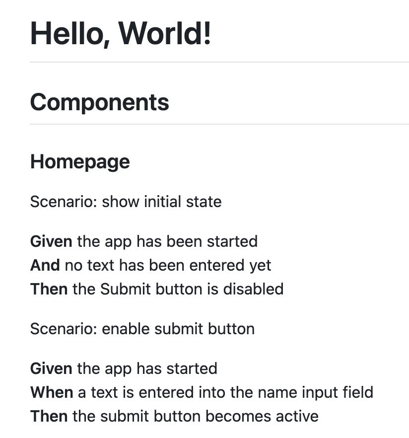

# Gherkin

This is a commandline utility tool that can generate "feature" files in Gherkin syntax from the tests of source code and vice versa.

The tool is not generally applicable to all projects in the world, but makes the assumption that projects that use the "gherkin" tool write the tests having the Gherkin style in mind:

- Every test file represents on Feature

Like the Dart programming language has been designed to contain only features that can be compiled to JavaScript, the Gherkin tool can only process source code that uses framework features that can be conceptually mapped to Gherkin features. The tool rejects to process files that do not abide by these assumptions.

For example, in TypeScript projects:

- "describe" block is mapped to "Feature"
- "beforeEach" is mapped to "Background"
- Nested "describe" block is mapped to "Rule"
- "it" is mapped to "Scenario"

Key features

- Reverse engineer feature files from test files (Jasmine, Go, Java)
- Create test file scaffold from feature files (Angular, Go, Java)
- Export feature files into Jira syntax

## Overview

The tool allows reverse engineering of existing code into specification documents:

|  |  |  |
| --- | --- | --- |
| Existing code | Feature files | Specification |

This is done to explore the possibility of specification-driven development based on Gherkin scenarios:

|  |  |  |
| --- | --- | --- |
| Specification  | Test definition | Generated code |

## Installation

```sh
go install
```

## Development

### Run tests

```sh
go test ./...
```

## Integration tests

```sh
TEMP_DIR=$(mktemp -d)
go run main.go rev --source "$SOURCE_DIR" --target "$TEMP_DIR" && code $TEMP_DIR
```

## Maintenance

### Open GitHub issue in the browser

If the GitHub CLI tool `gh` is installed, the description for a ticket can be opened like this:

```sh
ISSUE_NUMBER=10
gh issue view ${ISSUE_NUMBER} --json url
```

## Alternatives

**Test execution engines**

- [Cucumber](https://cucumber.io/)

**Development processes**

- [Structured-Prompt-Driven Development (SPDD) | Wei Zhang, Jessie Jie Xia | martinfowler.com](https://martinfowler.com/articles/structured-prompt-driven)
- [AI Unified Process (AIUP)](https://unifiedprocess.ai/)

**Annotated Textual Descriptions of Processes (ATDP)**

- [Process Extraction from Text | Patrizio Bellan et al. | arxiv.org](https://arxiv.org/pdf/2110.03754)

## Credits

- The Given/When/Then notation originates from the concept of Behavior-Driven-Development (BDD) invented by Daniel Terhorst-North and Chris Matts (see [martinfowler.com](https://martinfowler.com/bliki/GivenWhenThen.html)). 
- The Gherkin language is a formalization of the Given/When/Then notation invented by Aslak Hellesøy for the [Cucumber](https://cucumber.io) test execution engine (see [infoq.com](https://www.infoq.com/news/2018/04/cucumber-bdd-ten-years/)).
- A secondary goal of this project is to explore the benefits and limits of agentic coding. The original proof-of-concept has been generated with JetBrains Junie and the directly provided models. The ongoing development is done using JetBrains Junie and local models from the [adesso ai hub](https://www.adesso.de/en/technologies/adesso-business-cloud/ai-hub.jsp).

## References

- https://cucumber.io/docs/gherkin/reference/
- https://github.com/cucumber/gherkin
- https://marketplace.visualstudio.com/items?itemName=alexkrechik.cucumberautocomplete
